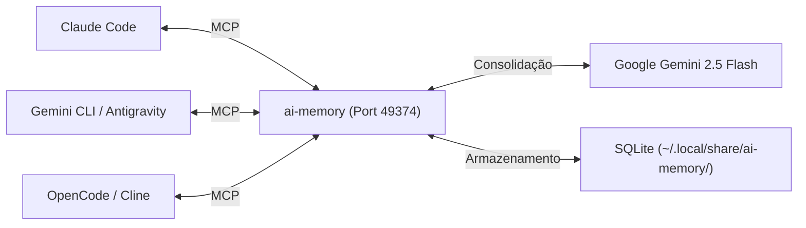

# Tutorial Prático: ai-memory com Gemini 2.5 Flash
> **Guia Completo de Uso, Comandos, Integração MCP e Truques Avançados**

---

## 1. Visão Geral e Arquitetura

O **`ai-memory`** é um sistema de memória de longo prazo projetado para resolver a "amnésia" e a falta de comunicação entre diferentes agentes de IA (Claude Code, Gemini CLI, Antigravity, OpenCode, VS Code Cline e Aider).

### Por que esta configuração é especial?
- **Protocolo Universal MCP**: Todos os agentes conectam-se ao mesmo servidor local (`http://127.0.0.1:49374/mcp`).
- **Motor Gemini 2.5 Flash**: A síntese e a consolidação de notas rodam na nuvem do Google de forma ultrarrápida, com **zero consumo de CPU/GPU e bateria no seu laptop**.
- **Persistência Inteligente (SQLite + FTS5)**: Em vez de bancos vetoriais pesados e imprecisos, utiliza notas estruturadas com busca em texto completo e grafos de conhecimento.



---

## 2. Gerenciamento do Serviço (`fzl-ai-memory`)

O utilitário `fzl-ai-memory` (localizado em `/usr/local/bin/fzl-ai-memory`) facilita a administração do serviço:

### Verificar o Status do Servidor
```bash
fzl-ai-memory status
```
*Saída esperada:*
```text
Checking ai-memory status on http://127.0.0.1:49374...
✅ ai-memory server is UP and responding at http://127.0.0.1:49374
   MCP Endpoint: http://127.0.0.1:49374/mcp
   Web Dashboard: http://127.0.0.1:49374/web
```

### Iniciar e Parar o Serviço
```bash
# Iniciar o serviço (via systemd --user)
fzl-ai-memory start

# Parar o serviço temporariamente
fzl-ai-memory stop
```

### Abrir o Painel Web (Dashboard)
```bash
fzl-ai-memory web
```
*Ou abra diretamente no navegador:* **http://127.0.0.1:49374/web**

---

## 3. Comandos de Linha de Comando (CLI Manual)

Você pode interagir diretamente com a memória pelo terminal sem precisar abrir uma IA:

### 3.1. Escrever / Atualizar uma Página de Memória
```bash
ai-memory write-page --path "arquitetura/banco-de-dados.md" --body "# Banco de Dados\n\n- PostgreSQL 16 na porta 5432.\n- As migrações rodam via Flyway."
```

### 3.2. Buscar na Memória (Full-Text Search)
```bash
ai-memory search "PostgreSQL"
ai-memory search "migrações"
```

### 3.3. Ler uma Página Completa
```bash
ai-memory read-page arquitetura/banco-de-dados.md
```

### 3.4. Testar a Conexão com o Gemini 2.5
```bash
ai-memory llm-test --provider gemini --model gemini-2.5-flash --prompt "Olá Gemini! Responda 'Memória Ativa' se estiver tudo OK."
```

---

## 4. Como os Agentes Usam a Memória (Fluxo MCP Automático)

Quando você inicia o **Claude Code**, o **Gemini CLI** ou o **OpenCode**, o Ansible já deixou configurado o servidor MCP.

### O que o Agente faz nos bastidores:
1. **No início da sessão**: Ele executa a ferramenta MCP `search_memory` ou `memory_read_page` para carregar o contexto acumulado do projeto.
2. **Durante o trabalho**: Quando descobre uma regra ou toma uma decisão, ele executa `save_observation` ou `memory_write_page`.
3. **Em background**: O Gemini 2.5 Flash varre essas notas e sintetiza resumos estruturados na wiki interna.

---

## 5. Dicas e Truques Avançados (Pro-Tips & Tricks)

### 💡 Truque 1: O Prompt Mágico de "Handoff" entre Agentes
Se você está planejando uma feature no **Gemini CLI** ou **Antigravity** e quer que o **Claude Code** ou **Aider** execute o código:

> **No Gemini:**  
> *"Terminamos a especificação da feature de autenticação. Por favor, grave um resumo com os passos de implementação na nossa memória compartilhada via MCP."*

> **No Claude Code / OpenCode (em seguida):**  
> *"Consulte nossa memória compartilhada sobre a feature de autenticação e comece a implementação do Passo 1."*

---

### 💡 Truque 2: Inicializar Projetos Legados (`ai-memory bootstrap`)
Se você entrou em um projeto antigo que já tem vários commits e documentação, você pode pedir para o Gemini analisar o histórico e preencher a memória de uma vez só:

```bash
cd /caminho/do/seu/projeto
ai-memory bootstrap
```
*O `ai-memory` vai ler o `git log`, `README.md` e arquivos de `docs/` e gerar automaticamente as páginas iniciais da wiki.*

---

### 💡 Truque 3: Navegação Visual pelo Dashboard Web
Acesse **http://127.0.0.1:49374/web** para:
- Ver o grafo de conexões entre arquivos e decisões.
- Editar páginas de documentação diretamente pela interface web.
- Revisar o histórico de observações registradas por cada agente.

---

### 💡 Truque 4: Backup e Restauração da Memória
Toda a memória fica salva em `~/.local/share/ai-memory/`. Você pode criar snapshots para levar para outro computador:

```bash
# Criar backup compactado
ai-memory backup --out ~/meu-backup-ai-memory.tar.gz

# Restaurar backup
ai-memory restore ~/meu-backup-ai-memory.tar.gz
```

---

### 💡 Truque 5: Reindexação do Banco SQLite
Se por algum motivo o banco SQLite precisar ser reconstruído a partir dos arquivos Markdown brutos:

```bash
fzl-ai-memory stop
ai-memory reindex
fzl-ai-memory start
```

---

## 6. Resumo Rápido de Atalhos

| O que você quer fazer? | Comando |
| :--- | :--- |
| Checar se a memória está rodando | `fzl-ai-memory status` |
| Iniciar a memória | `fzl-ai-memory start` |
| Parar a memória | `fzl-ai-memory stop` |
| Abrir o painel web | `fzl-ai-memory web` |
| Pesquisar algo rápido | `ai-memory search "<termo>"` |
| Salvar uma anotação | `ai-memory write-page --path "<caminho>" --body "<texto>"` |
| Fazer bootstrap de projeto | `ai-memory bootstrap` |
